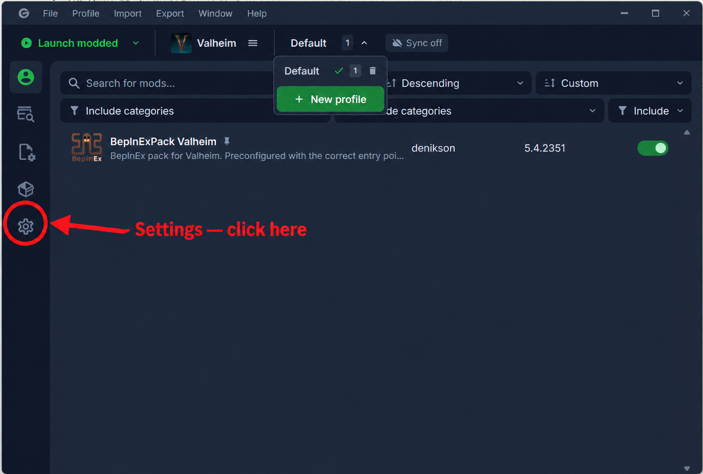

# DevTools

This BepInEx plugin adds the `spawn60` cheat command for testing. It spawns one each of 60 different materials near your character using Valheim's built-in `spawn` command.

## Build and install

From the repository root, run `dotnet build .\ValheimMods\ValheimMods.sln`. The shared build target copies `DevTools.dll` to the selected Gale profile's `BepInEx\plugins` folder. Launch Valheim with **Start modded** in Gale.

## Enable the developer console

In Gale, select the Valheim profile where you installed DevTools and click the **Settings** gear in the far-left sidebar:

On the Settings page, check **Valheim settings → Launch → Launch mode**:

- If it is **Direct**, scroll to **Profile settings → Launch → Custom launch arguments** and enter `-console`.
- If it is **Platform (Steam)**, add `-console` in **Steam → Valheim → Properties → General → Launch Options** instead.

Launch the game modded through Gale. In your own world, press **F5** to open the console and enter `devcommands`. Enter `spawn60` to spawn the materials. If Valheim asks you to confirm cheats, enter `confirmcheats` and then repeat `spawn60`.

Cheat commands and spawned items can affect achievements in Valheim 1.0.
